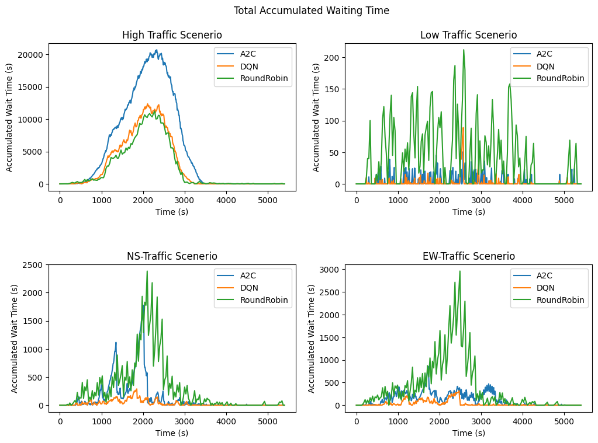
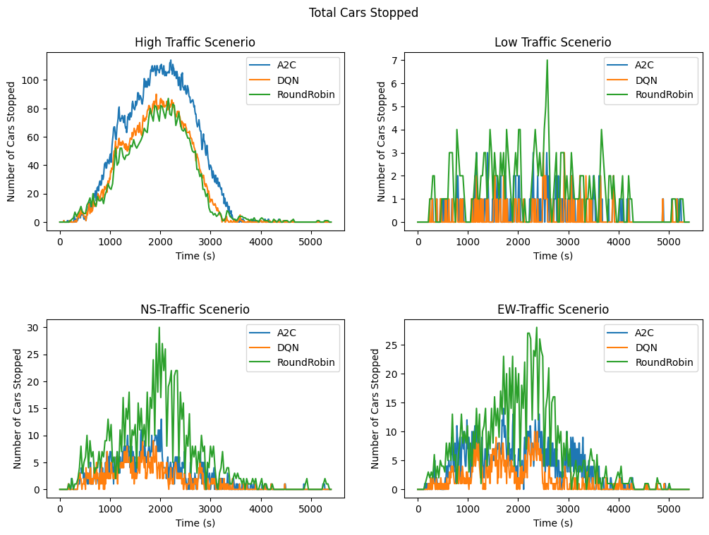

# Automated Traffic Light Control

This repository contains an implementation of Reinforcement Learning (RL) algorithms for intelligent traffic signal control, with special handling for emergency vehicles. The project builds upon the [SUMO-RL](https://github.com/LucasAlegre/sumo-rl) framework and introduces novel extensions for multi-route scenarios and emergency vehicle prioritization.

## Features

- **Multi-Route Environment**: Enhanced SUMO-RL environment supporting multiple route files that randomly change between episodes
- **Emergency Vehicle Handling**: Specialized environment and components for prioritizing emergency vehicles
- **Custom Components**:
  - Emergency observation function with normalized features
  - Priority-aware reward function
  - Dedicated emergency environment with specialized metrics

## Architecture

### MultiRouteSumoEnvironment

The `MultiRouteSumoEnvironment` extends the base SUMO-RL environment to support multiple route files. Key features:
- Random selection of route files between episodes
- Maintains compatibility with original SUMO-RL interface
- Seamless integration with existing RL algorithms

### EmergencySumoEnvironment

Built on top of the multi-route environment, adding:
- Emergency vehicle tracking
- Specialized metrics (emergency vehicle waiting time, emergency vehicle count)
- Enhanced state observations for emergency scenarios

### Emergency-Aware Components

1. **Observation Function**:
   - Normalized traffic features
   - Emergency vehicle queue ratios
   - Priority indicators for immediate attention
   - Compatible with standard gym spaces

2. **Reward Function**:
   - Balanced regular and emergency vehicle priorities
   - Speed ratio considerations
   - Normalized waiting time penalties
   - Delta-based reward calculation

## Results

### Multi-Route Training

Training results comparing DQN and A2C algorithms on the multi-route environment:





### Emergency Vehicle Prioritization

Results from DQN training on the emergency environment:


## Installation

```bash
# Clone the repository
git clone https://github.com/Saksham1970/automated-traffic-light-control.git
cd automated-traffic-light-control

# (Optional, might be needed for installation of gymnasium[box2d]) Install swig
# pip install swig

# Install dependencies
pip install -r requirements.txt
```

## Usage

```python
from environment.environment import MultiRouteSumoEnvironment, EmergencySumoEnvironment
from environment.observation import EmergencyObservationFunction
from environment.reward import emergency_reward

# Create environment with multiple routes
env = MultiRouteSumoEnvironment(
    net_file='path/to/network.net.xml',
    route_files=['route1.rou.xml', 'route2.rou.xml']
)

# Or use the emergency-focused environment
env = EmergencySumoEnvironment(
    net_file='path/to/network.net.xml',
    route_files=['route1.rou.xml', 'route2.rou.xml'],
    observation_class=EmergencyObservationFunction,
    reward_fn=emergency_reward
)
```

## Dependencies

- SUMO-RL
- SUMO
- Gymnasium
- Stable Baselines 3 (for DQN and A2C implementations)

## Acknowledgments

This project builds upon the [SUMO-RL](https://github.com/LucasAlegre/sumo-rl) framework. We thank the original authors for their valuable contribution to the traffic control research community.

## License

This project is licensed under the MIT License - see the [LICENSE](LICENSE) file for details.
